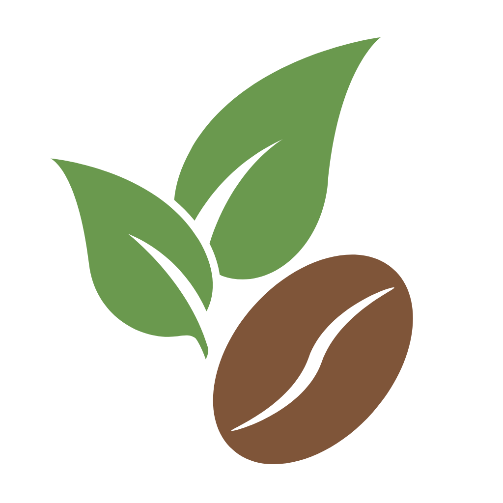
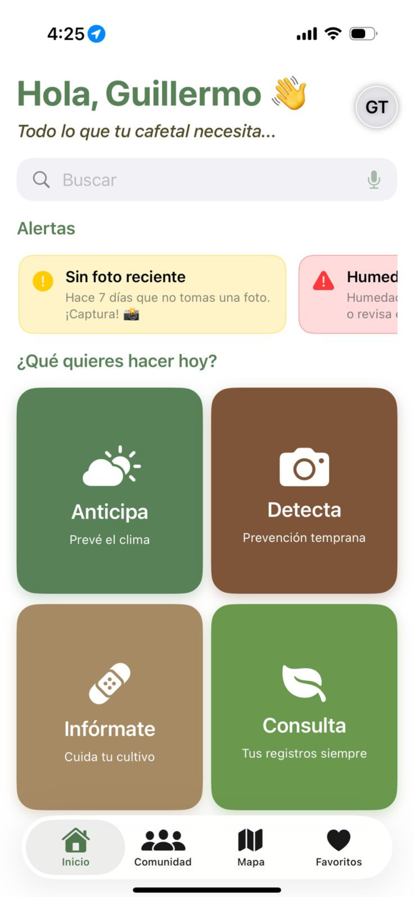
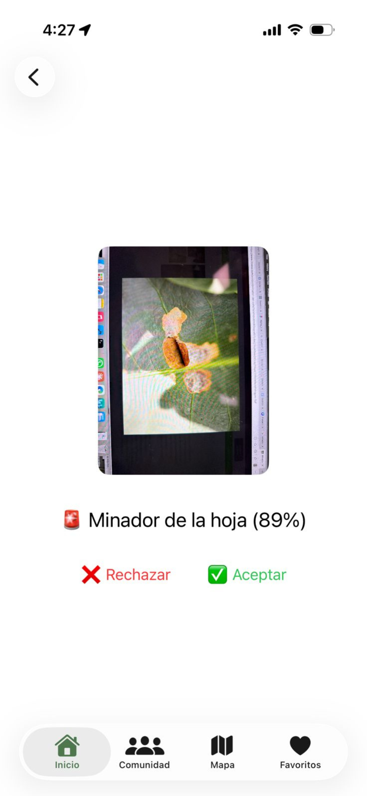
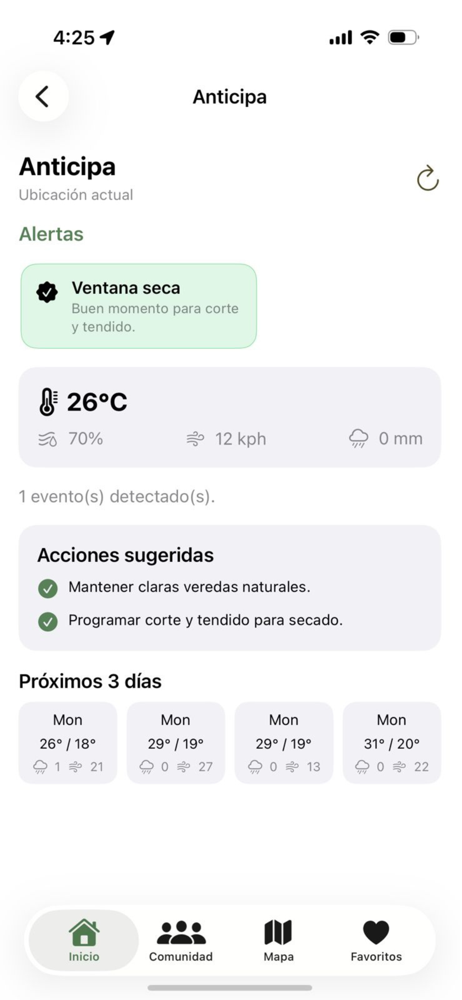
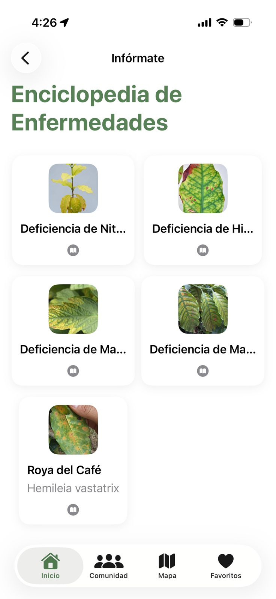
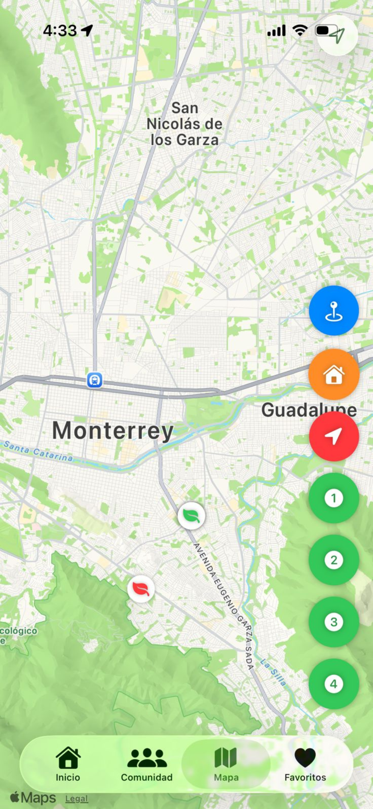
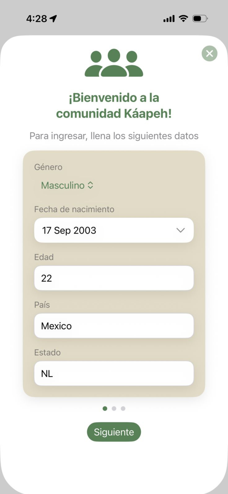
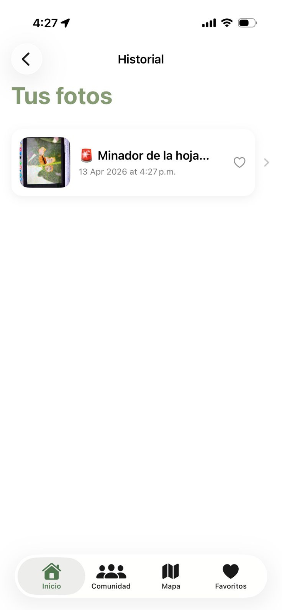

<p align="center">
  
</p>

<h1 align="center">KafeCam</h1>

<p align="center">
  Coffee crop monitoring and early disease detection for iOS
</p>

<p align="center">
  
  
  
  
  
</p>

---

## About

KafeCam is an iOS application built for coffee farmers and field technicians in Mexico. It combines on-device machine learning, real-time weather intelligence, and cloud-synced plot management to help growers detect diseases early, track crop health over time, and stay coordinated with their agricultural technicians — all from their phone.

The app is designed for working conditions in rural coffee-growing regions, including communities in Chiapas that speak Tzotzil as their primary language.

---

## Features

**Detecta — Early disease detection**
Point your camera at a coffee plant and KafeCam classifies diseases and nutritional deficiencies on-device using CoreML. Each result shows a confidence score with an Accept or Reject step before the capture is saved to your history.

**Anticipa — Weather and risk forecasting**
Pulls real-time conditions and a 3-day forecast for your plot location, then translates meteorological data into agricultural risk alerts — dry windows for harvesting, frost warnings, and optimal spray conditions.

**Infórmate — Disease encyclopedia**
A visual reference covering the five most common threats to coffee crops: Coffee Rust (*Hemileia vastatrix*), Nitrogen deficiency, Iron deficiency, Magnesium deficiency, and Manganese deficiency. Each entry includes field photographs, symptoms, and treatment guidance.

**Consulta — Capture history**
A full chronological record of all your field captures, with disease labels, timestamps, per-capture notes, and a favorites system. Synced to Supabase and available across devices.

**Mapa — Plot management**
GPS-tagged plots displayed on an interactive map. Each disease detection can be pinned to a specific plot, giving you a geographic record of where problems have appeared and how they spread over time.

**Comunidad — Farmer-technician network**
Role-based user system where farmers can request assignment to a field technician for ongoing monitoring and professional recommendations. Technicians manage their farmer list directly from the app.

**Multilingual — Spanish, English, and Tzotzil**
Full UI localization in Spanish and English. Tzotzil support is in active development, in recognition of the indigenous farming communities that grow a significant portion of Mexico's coffee.

---

## Tech Stack

| Layer | Technology |
|---|---|
| Language | Swift 5.0 |
| UI Framework | SwiftUI |
| Machine Learning | CoreML + Vision (on-device) |
| Backend | Supabase (PostgreSQL, Auth, Storage, Edge Functions) |
| Maps | MapKit + CoreLocation |
| Weather | Open-Meteo API |
| Platforms | iOS 16+, iPadOS, macOS, visionOS |

---

## Architecture

KafeCam follows an **MVVM + Repository** pattern.

```
Views (SwiftUI)
  └── ViewModels (@StateObject / @EnvironmentObject)
        └── Services (CapturesService, WeatherService)
              └── Repositories (6 — one per domain entity)
                    └── Supabase (PostgREST + Storage + Edge Functions)
```

Row-Level Security is enforced at the database level. The app uses only the public anonymous key — the service role is never present on-device.

---

## Getting Started

**Requirements**
- Xcode 15 or later
- iOS 16+ simulator or physical device
- A Supabase project (see Configuration below)

**Setup**

```bash
git clone https://github.com/2kLira/KafeCam.git
cd KafeCam
open KafeCam.xcodeproj
```

`KafeCam/Configuration/SupabaseConfig.swift` is excluded from version control. You must create it manually before building:

```swift
// KafeCam/Configuration/SupabaseConfig.swift
import Foundation

enum SupabaseConfig {
    static let url     = URL(string: "https://<your-project-ref>.supabase.co")!
    static let anonKey = "<your-anon-key>"
}
```

Get these values from your Supabase project under **Project Settings → API**.

---

## Database

The app connects to a Supabase PostgreSQL database with the following schema:

| Table | Description |
|---|---|
| `profiles` | User accounts with role, contact info, and visibility preferences |
| `plots` | GPS-tagged coffee plantation plots owned by farmers |
| `captures` | Photo captures with disease labels, timestamps, and storage keys |
| `diagnoses` | ML diagnosis records linked to captures |
| `diseases` | Reference catalogue of coffee diseases and deficiencies |
| `recommendations` | Agronomic recommendations linked to diagnoses |
| `soil_readings` | Soil sensor measurements (moisture, temperature, pH) |
| `weather_snapshots` | Historical weather readings per plot |
| `notifications` | In-app notification queue |
| `consents` | User consent records for data and privacy |
| `audit_log` | Append-only audit trail for sensitive operations |

---

## User Roles

KafeCam has three roles: `farmer`, `technician`, and `admin`.

**Promote a user via Supabase SQL editor**

```sql
-- Promote to technician
UPDATE public.profiles SET role = 'technician' WHERE phone = '9511407969';

-- Promote to admin
UPDATE public.profiles SET role = 'admin' WHERE phone = '9511407969';

-- Match by email instead
UPDATE public.profiles SET role = 'technician' WHERE email = '1234567890@kafe.local';
```

**Assign a farmer to a technician manually**

```sql
INSERT INTO public.technician_farmers (technician_id, farmer_id)
VALUES ('<TECHNICIAN_UUID>', '<FARMER_UUID>');
```

Technicians can also assign and unassign farmers directly from the app under **Profile > Farmers**.

---

## Localization

| Code | Language | Status |
|---|---|---|
| `es` | Spanish | Complete |
| `en` | English | Complete |
| `tzo` | Tzotzil | Beta |

To switch language in the app, go to **Profile > Language**.

---

## Screenshots

<p align="center">
  
  
  
</p>
<p align="center">
  
  
  
  
</p>

---

## License

© 2025 KafeCam. All rights reserved.
